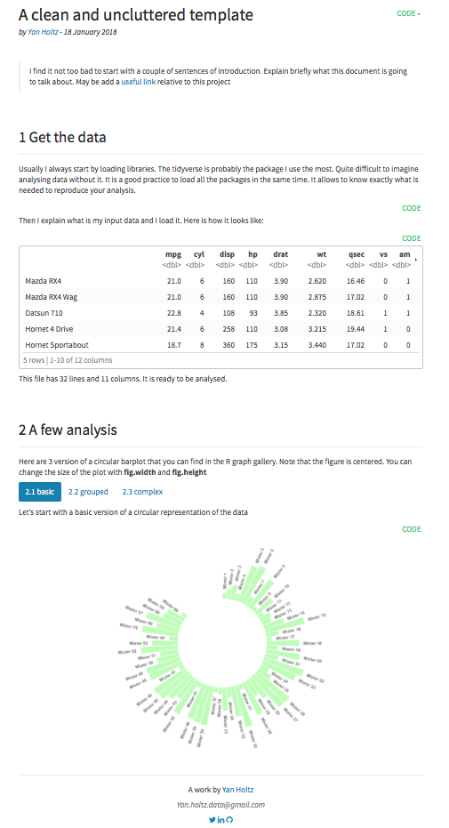

   epuRate: my personal rmd template
===================


Overview
--------
I am a big fan of [**R MarkDown**](https://rmarkdown.rstudio.com). This tool allows you to create interactive documents with text, figures and R code. I use it on a daily basis for my data analysis, wether it is to share it with others or simply to remember what I've done.

This repository is a custom template for R Markdown. It is based on the default rmd format. I just added a few lines of CSS + a html footer giving my contact details. It allows me to quickly start a new report.

The html output looks like this:

***

***


Using it
--------
I created this template for my personnal use but feel free to use it:
- Install the library in R:
```
library(devtools)
devtools::install("epuRate")
library(epuRate)
```
- Open a new rmd file in Rstudio: File -> New File -> R Markdown -> From Template -> My Template by epuRate.


Acknowledgment
--------
Thanks to [Rstudio](https://www.rstudio.com) and its team for developing so many awesome tools.


