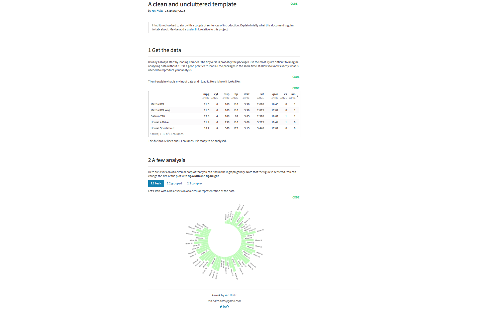

   An uncluttered R Markdown template
===================

<br>

See it live [**here**](https://holtzy.github.io/epuRate/).

<br>

Overview
--------
EpuRate is [a custom R Markdown template](https://holtzy.github.io/epuRate/) for your reports. It allows to get a uncluttered output with your contact details in the footer. It is very easy to use.

The html output looks like this: (you can also see a real version [**here**](https://holtzy.github.io/epuRate/)

***


***


Using it
--------

- Install the R package:
```
library(devtools)
install_github("holtzy/epuRate")
library(epuRate)
```
- Open a new rmd file in Rstudio: File -> New File -> R Markdown -> From Template -> epuRate.

- Change  the Header of your document with your name, email adress, github / twitter / linkedIn details if you want to display them.


Acknowledgment
--------
Thanks to [Rstudio](https://www.rstudio.com) and its team for developing so many awesome tools.


